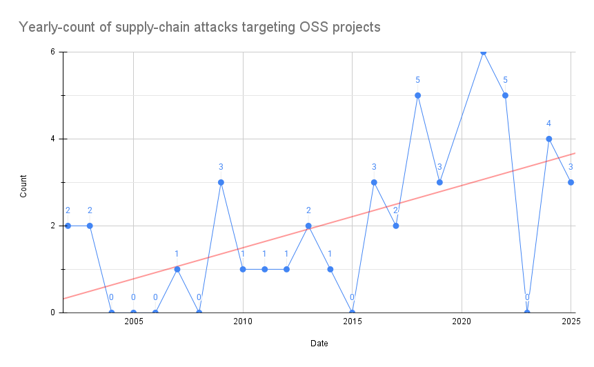

# actual-supplychain-attacks

Data about all known supply-chain attacks against software projects throughout history. This only includes cases that attacked a known product/project or its official distribution mechanisms (such as source code, offical mirror, container registry).

We do not include attacks that involved random USB keys found on the sidewalk, typo-squatting attacks within random websites, unauthorized distribution mechanisms, or other types of social engineering attacks.

## Pwn Count

* 53 OSS projects
* 56 incidents

## PR's welcome!

This project is very much a work in progress. The data is incomplete and often inaccurate. PR's welcome!
