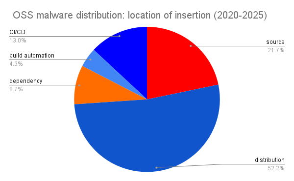

# supplychain-attack-data

This repository contains comprehensive data about actual software supply-chain attacks throughout history.

This repository only includes cases where an open-source project or commercial product distributed compromised software knowingly or accidentally. We do also include edge cases, such as when an open-source project has shut-down and an attacker later takes over their accounts.

We do not include drive-by attacks that had no involvement with a project or its regular distribution channels, such as:

- Random USB keys found on a sidewalk
- Typosquatting attacks
- Malware uploaded to random websites unrelated to the project

## OSS Pwn Count

* 56 OSS projects
* 59 incidents

To the best of my knowledge, this data is complete, but if you know of any cases where a software supply-chain attack impacted a known open-source project, please open an issue.

## Proprietary Pwn Count

* 42 products & incidents

Note: Available data on commercial software supply-chain attacks is limited, as attacks on commercial tools often go unannounced. This number is almost certainly a severe undercount.

## PR's welcome!

This project is a work in progress. PR's welcome!
