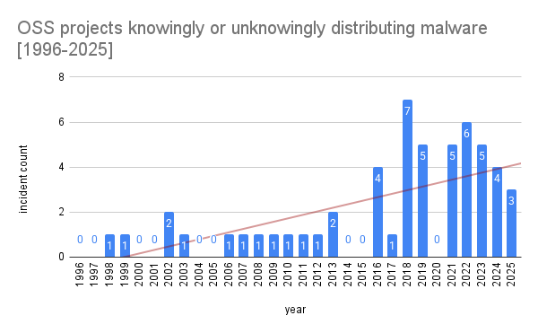

# supplychain-attack-data

Welcome to the most comprehensive dataset on software supply-chain attacks in the world!

## Incident Criteria

This repository only includes cases where an open-source project or commercial product distributed malware knowingly or unknowingly. We also include edge cases, such as when an open-source project has shut down and an attacker later takes over its online presence.

- Malware uploaded to a random website with no relationship to the project or product
- Random USB keys found on a sidewalk
- Projectsonly known in the context of delivering malware (for example, a project created solely to demonstrate an attack)
- Typosquatting attacks

## OSS Pwn Count

* 56 OSS projects
* 59 incidents

To the best of my knowledge, this data is complete, but if you know of any cases where an open-source project distributed malware, please open an issue.

## Proprietary Pwn Count

* 45 products & incidents

Note: Available data is limited as many commercial attacks go unreported.

## PR's welcome!

This project is a work in progress. PR's welcome!
